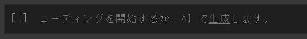

<div class="title">DA研 プログラミング勉強会</div>

---

<!-- _class:  mokuji -->

<div class="split">
<div class="percent_45">

# <span style="float:right">目次

</div>
<div class="percent_50" style="padding: 20px 0 0 30px">

###### <span style="font-size:18px">クリックすることでそのページに飛びます</span>

</div>
</div>

###### <br>

<div class="split">
<div class="percent_45">

1. ## [事前準備](#3)

2. ## [演算と変数](#8)

3. ## [条件分岐 `if`](#18)

4. ## [繰り返し① `while`](#27)

5. ## [配列 `list`](#31)

</div>
<div class="percent_10">
</div>
<div class="percent_45">

6. ## [繰り返し② `for`](#39)

7. ## [関数](#44)

8. ## [アルゴリズム](#54)

9. ## [最後に](#59)

</div>
</div>

---

<!-- _class:  mokuji -->

# <br>

<div class="split">
<div class="percent_45">

1. # 事前準備

2. ## [演算と変数](#8)

3. ## [条件分岐 `if`](#18)

4. ## [繰り返し① `while`](#27)

5. ## [配列 `list`](#31)

</div>
<div class="percent_10">
</div>
<div class="percent_45">

6. ## [繰り返し② `for`](#39)

7. ## [関数](#44)

8. ## [アルゴリズム](#54)

9. ## [最後に](#59)

</div>
</div>

---

## Google Colaboratoryとは

##### この勉強会では Google Colaboratory というブラウザ上のツールを使って Python を勉強していきます．

##### Google Colaboratory はブラウザ上で Python を記述・実行できるサイトで，以下のような特徴があります．

1. 環境構築が不要
2. GPU に料金なしでアクセス
3. 簡単に共有

##### 今回は 1 の「**環境構築が不要**」という点から Google Colaboratory を使うことに<br>しています．

---

## Google Labolatory にログイン

<div class="split">
<div class="percent_65">

#### まずは [Google Colaboratory](https://colab.research.google.com/) に Chrome でアクセスして，自分の Google アカウントでログインして下さい．

#### 既にログインしている Chrome でアクセスすれば，勝手に Google Colaboratory にもログインされると思います．

</div>
<div class="percent_5">
</div>
<div class="percent_30">


</div>

---

## 用語の説明

<div class="split">
<div class="percent_55">

#### コード

##### コンピュータへの命令を記述したもの

#### セル

##### コードを書くための長方形のボックスのこと

</div>
<div class="percent_40">
<br><br><br><br>
<div style="text-align: center">



</div>
</div>
</div>
<div class="split">
<div class="percent_70">

#### 実行する

##### 「`Shift`+`Enter`」or「`Ctrl`+`Enter`」or「セルの左の<br>再生ボタン」を押して書いたプログラムを動かすこと

</div>
<div class="percent_20">
<br>
<div style="text-align: center">


</div>
</div>
</div>

---

## 実行結果の確認

##### `print()`で標準出力して，実行結果を確認することができます．

<div class="split">
<div class="percent_60">

##### <br>

```python
print("Hello, World!")
```

</div>
<div class="percent_35">

##### 実行結果

```
Hello, World!
```

</div>
</div>

##### Google Colaboratory や Jupyter Notebook などの IPython NoteBookファイルでは，以下のように出力したいものを最後に記述することで`print()`なしでも出力することができますが，この勉強会では全て`print()`を用いて出力します．

<div class="split">
<div class="percent_60">

##### <br>

```python
"Hello, World!"
```

</div>
<div class="percent_35">

##### 実行結果

```
'Hello, World!'
```

</div>
</div>

---

<!-- _class:  mokuji -->

# <br>

<div class="split">
<div class="percent_10">
</div>
<div class="percent_45">

1. ## [事前準備](#3)

2. # 演算と変数

3. ## [条件分岐 `if`](#18)

4. ## [繰り返し① `while`](#27)

5. ## [配列 `list`](#31)

</div>
<div class="percent_45">

6. ## [繰り返し② `for`](#39)

7. ## [関数](#44)

8. ## [アルゴリズム](#54)

9. ## [最後に](#59)

</div>
</div>

---

## 四則演算

<div class="split">
<div class="percent_65">

##### 足し算 \+

```python
print(3 + 6)
```

##### 引き算 \-

```python
print(7 - 2)
```

##### かけ算 \*

```python
print(5 * 4)
```

##### 割り算 /

```python
print(9 / 2)
```

</div>
<div class="percent_35">

##### 実行結果

```
9
```

##### <br>

```
5
```

##### <br>

```
20
```

##### <br>

```
4.5
```

---

## 少し複雑な演算

<div class="split">
<div class="percent_60">

##### 累乗計算 \*\*

```python
print(2 ** 5)
print(100 ** 0)
```

<br>

##### 累乗根は累乗計算を利用します

```python
print(2 ** 0.5)
print(81 ** (1/4))
```

</div>
<div class="percent_35">

##### 実行結果

```
32
1
```

<br>

##### <br>

```
1.4142135623730951
3.0
```

</div>
</div>

---

## プログラミングやPython特有の演算

<div class="split">
<div class="percent_65">

##### Mod演算 %<br> (高校数学で言うところの合同式)

```python
print(8 % 3)  # 8 ÷ 3 = 2 余り 2
```

<br>

##### 割り算結果の整数部を返す //<br>(小数点以下切り捨てとも言える)

```python
print(9 // 2)
```

</div>
<div class="percent_35">

##### <br>実行結果

```
2
```

<br>

##### <br><br>

```
4
```

</div>
</div>

---

## 文字列の演算

<div class="split">
<div class="percent_65">

##### 文字列同士の足し算や数字とのかけ算もすることが<br>できます．

```python
print("文字列a" + "と" + "文字列b")
print("文字列" * 3)
```

</div>
<div class="percent_35">

##### <br>実行結果

```
文字列aと文字列b
文字列文字列文字列
```

</div>
</div>

##### これらを使ってこんなこともできます．

```python
print("にわ" * 4 + "とりがいる")
```

##### 実行結果

```
にわにわにわにわとりがいる
```

---

## 変数と代入

##### `x = 5`とすると，`x`の中身を`5`という値に置き換えることができます．<br>このとき x を「変数」と言い，置き換える操作のことを「代入」と言います．

###### 数学での「=」とは意味合いが異なり，`x`と`5`が等しいという意味ではないことに注意して下さい．

<div class="split">
<div class="percent_60">

##### <br>

```python
x = 5
print(x)
print(x + 7)
y = 3
print(x * y)
```

</div>
<div class="percent_35">

##### 実行結果

```

5
12

15
```

</div>
</div>

---

##### 「代入」と言うと数学っぽいかもしれませんが，文字列やほかの値などなんでも代入することができます．

<div class="split">
<div class="percent_60">

##### <br>

```python
s = "Good"
print(s)
t = "Morning"
print(s + t)
```

</div>
<div class="percent_35">

##### 実行結果

```

Good

GoodMorning
```

</div>
</div>

###### よく，「変数」という箱に「値」というボールを入れる，と例えられます．

---

## 再代入

##### 一度代入した変数にもう一度代入することで値を上書きすることができます．

<div class="split">
<div class="percent_60">

##### <br>

```python
x = 8
print(x)
x = 4
print(x)
```

######

```python
s = "today"
print(s)
s = "tomorrow"
print(s)
```

</div>
<div class="percent_35">

##### 実行結果

```

8

4
```

######

```

today

tomorrow
```

</div>
</div>

---

## 変数を変数に代入

##### 変数を変数に代入すると，元の変数に入っていた値が新たな変数にも入ります．

###### 元の変数はなにも変化しません．

<div class="split">
<div class="percent_60">

##### <br>

```python
x = 7
print(x)
y = x
print(y)
print(x)
```

</div>
<div class="percent_35">

##### 実行結果

```

7

7
7
```

</div>
</div>

---

## 複合代入演算子

##### `x += 3`のように書くことで`x = x + 3`と同じ操作をすることができます．<br>つまり，ある演算をしながら元の変数に代入することができます．

<div class="split">
<div class="percent_60">

##### <br>

```python
y = 9
y /= 3
print(y)
```

<br>

```python
x = 5
x **= 3
print(x)
```

</div>
<div class="percent_35">

##### 実行結果

```


3.0
```

<br>

```


125
```

</div>
</div>

---

<!-- _class:  mokuji -->

# <br>

<div class="split">
<div class="percent_45">

1. ## [事前準備](#3)

2. ## [演算と変数](#8)

3. # 条件分岐 `if`

4. ## [繰り返し① `while`](#27)

5. ## [配列 `list`](#31)

</div>
<div class="percent_10">
</div>
<div class="percent_45">

6. ## [繰り返し② `for`](#39)

7. ## [関数](#44)

8. ## [アルゴリズム](#54)

9. ## [最後に](#59)

</div>
</div>

---

## 比較演算子と真偽値

##### 比較演算子とは，その演算子の左右にある値を比較する記号のことです．

##### 比較演算子には以下の種類があります

<div class="split">
<div class="division_3">

「==」：等しい
「!=」 ：等しくない

</div>
<div class="division_3">

「>」：より大きい
「<」：より小さい

</div>
<div class="division_3">

「>=」：以上
「<=」：以下

</div>

###### 数学でよく使っている等号は，Pythonでは「==」と同じ意味ですね．

---

##### 比較演算子で判定した結果は，真偽値（真もしくは偽のどちらかの値）になります．

##### Python では，真は <code class="true">True</code> 偽は <code class="false">False</code> で表します．

<div class="split">
<div class="percent_60">

##### <br>

```python
print(1 == 1)
print(1 != 1)
```

######

```python
print(2 < 3)
print(4 > 9)
```

######

```python
print(3 <= 1)
print(1 >= 1)
```

</div>
<div class="percent_35">

##### 実行結果

```python
True
False
```

######

```python
True
False
```

######

```python
False
True
```

</div>
</div>

---

## if文とは

##### 条件が成り立つかを判定して，その結果に応じて異なる処理をさせたいときに，if文を使います．

##### if文は直後にくる式の真偽値が真のとき，次の行から始まる部分の処理を行います．<br>この`if`の直後に来る式を「条件式」と呼びます．

##### 条件式が偽の時は処理を行いません．

<div class="split">
<div class="percent_60">

##### 使用例

```python
x = 5
if x < 10:
    print("xは10より小さいです")
```

</div>
<div class="percent_35">

##### 実行結果

###### ここでは`x < 10`が条件式です．

```
xは10より小さいです
```

</div>
</div>

###### 条件式の後ろのコロン(:)を忘れずに書きましょう！

---

## elseとは

##### if文の条件式が偽の時にも，何かの処理をさせたいときは`else`を使います．

<div class="split">
<div class="percent_60">

##### 使用例

```python
y = 20
if y < 10:
    print("yは10より小さいです")
else:
    print("yは10以上です")
```

###### elseの後ろのコロン(:)を忘れずに書きましょう！

</div>
<div class="percent_35">

##### 実行結果

```


yは10以上です
```

</div>
</div>

---

## elifとは

##### if文の条件式が偽である上で，さらに別の条件分岐を使いたいときは`elif`を使います．

<div class="split">
<div class="percent_60">

##### 使用例

```python
z = 15
if z < 10:
    print("zは10より小さいです")
elif z <= 20:
    print("zは10以上20以下です")
else:
    print("zは20より大きいです")
```

</div>
<div class="percent_35">

##### 実行結果

```


zは10以上20以下です


```

</div>
</div>

---

## ブロック

##### `if`や`else`は条件式が真の時，決められた処理を実行します．<br>その処理のかたまりをブロックと言います．

##### Pythonでは同じ**インデント**(スペースの数)がされている分のかたまりをブロックとして扱います．

<div class="split">
<div class="percent_60">

##### <br>

```python
x = 5
if x < 10:
    print(x)
    x += 8
    print(x)
```

</div>
<div class="percent_35">

##### 実行結果

```


5

13
```

</div>
</div>

###### 3行目から5行目までがif文の処理を行うブロックです．

---

## 入れ子構造(ネスト)

##### 複雑な条件分岐にしたいときに，if文の中に別のif文を書くことがあります．<br>このように書かれたif文の構造を入れ子構造(ネスト)と言います．

<div class="split">
<div class="percent_60">

##### 使用例

```python
x = 7
if x <= 10:
    if x < 5:
        print("xは5より小さいです")
    else:
        print("xは5以上で10以下です")
else:
    print("xは10より大きいです")
```

</div>
<div class="percent_35">

##### 実行結果

```


xは5以上で10以下です


```

</div>
</div>

---

<style scoped>
    table {
        table-layout: fixed;
        width: 100%;
        display: table;
        font-size: 30px;
        text-align: center;
    }
</style>

## 複雑な条件式 (and/or/not)

##### 複数の真偽値の組み合わせや，真偽値の否定によって真偽を決定したいときに，and/or/notを使います．

| A                                | B                                | A and B                          | A or B                           | not A                            |
| -------------------------------- | -------------------------------- | -------------------------------- | -------------------------------- | -------------------------------- |
| <code class="true">True</code>   | <code class="true">True</code>   | <code class="true">True</code>   | <code class="true">True</code>   | <code class="false">False</code> |
| <code class="true">True</code>   | <code class="false">False</code> | <code class="false">False</code> | <code class="true">True</code>   | <code class="false">False</code> |
| <code class="false">False</code> | <code class="true">True</code>   | <code class="false">False</code> | <code class="true">True</code>   | <code class="true">True</code>   |
| <code class="false">False</code> | <code class="false">False</code> | <code class="false">False</code> | <code class="false">False</code> | <code class="true">True</code>   |

###### よく見る表だね．

---

<!-- _class:  mokuji -->

# <br>

<div class="split">
<div class="percent_45">

1. ## [事前準備](#3)

2. ## [演算と変数](#8)

3. ## [条件分岐 `if`](#18)

4. # 繰り返し① `while`

5. ## [配列 `list`](#31)

</div>
<div class="percent_10">
</div>
<div class="percent_45">

6. ## [繰り返し② `for`](#39)

7. ## [関数](#44)

8. ## [アルゴリズム](#54)

9. ## [最後に](#59)

</div>
</div>

---

## while文とは

##### while文は，`while`の後ろに書く条件式が真の間，直後のブロックの処理を繰り返します．

<div class="split">
<div class="percent_60">

##### 使用例

```python
i = 0
while i < 3:
    print("現在のiは" + i)
    i += 1
```

</div>
<div class="percent_35">

##### 実行結果

```
現在のiは0
現在のiは1
現在のiは2
```

</div>
</div>

###### `i += 1`がないと，無限ループになっちゃうよ！

---

## while と if

##### 繰り返し処理の中で条件分岐を行いたいときに，while文の中でif文を使います．

<div class="split">
<div class="percent_60">

##### 使用例

```python
i = 0
while i < 3:
    print(i)
    if i % 2 == 0:
        print(i + "は偶数")
    i += 1
```

</div>
<div class="percent_35">

##### 実行結果

```
0
0は偶数
1
2
2は偶数
```

</div>
</div>

###### `i += 1`がないと，無限ループになっちゃうよ！

---

## break

##### whileループを「途中で」終了させたいときは，if文と`break`を利用します．<br>`break`は実行されると，処理を中断してwhileループを終了させます．

<div class="split">
<div class="percent_60">

##### 使用例

```python
i = 0
while i < 100:
    if i == 4:
        break
    print(i)
```

</div>
<div class="percent_35">

##### 実行結果

```
0
1
2
3
```

</div>
</div>

---

<!-- _class:  mokuji -->

# <br>

<div class="split">
<div class="percent_45">

1. ## [事前準備](#3)

2. ## [演算と変数](#8)

3. ## [条件分岐 `if`](#18)

4. ## [繰り返し① `while`](#27)

5. # 配列

</div>
<div class="percent_10">
</div>
<div class="percent_45">

6. ## [繰り返し② `for`](#39)

7. ## [関数](#44)

8. ## [アルゴリズム](#54)

9. ## [最後に](#59)

</div>
</div>

---

## 要素の指定

##### まとめて扱いたいデータがあるとき，配列を使うと便利です．`a = [1, 2, 3]`とすると，要素1, 2, 3を持つ配列が生成されます．<br>Pythonでは配列の1番目の要素を`a[0]`，2番目の要素を`a[1]`，3番目の要素を`a[2]`などと表します．

##### この「～番目」のことを **インデックス** と言います．

###### index は「索引」という意味です．

<div class="split">
<div class="percent_60">

##### <br>

```python
a = [2, 4, 6]
print(a[1])
```

</div>
<div class="percent_35">

##### 実行結果

```

4
```

</div>
</div>

---

## 要素の指定

##### 配列を扱うときは，「0から」インデックスが振られること(0-indexed)に<br>注意しましょう．

###### プログラミングでは基本的に0-indexedを採用しています．

<br>

##### &nbsp;&nbsp;&nbsp;問題．次の配列から`30`を指定して出力するコードは？

```python
a = [10, 20, 30, 40]
```

<details>
<summary>

##### 答え

</summary>

```python
print(a[2])
```

</details>

---

## 要素の変更

##### 配列の要素を変更したいときは，位置を指定して代入します．

`a[i] = x`で配列`a`のi番目をxに変更します．

<div class="split">
<div class="percent_60">

##### <br>

```python
a = [1, 2, 3]
a[1] = 5
print(a)
```

</div>
<div class="percent_35">

##### 実行結果

```


[1, 2, 5]
```

</div>
</div>

---

## 要素の追加

##### 配列に要素を追加しようときは，`append()`を使う方法と`insert()`を使う方法の<br>2通りあります．

1. 配列の末尾に要素を追加する`append()`

<div class="split">
<div class="percent_60">

##### <br>

```pytnon
a = [1, 2, 3]
a.append(5)
print(a)
```

</div>
<div class="percent_35">

##### 実行結果

```


[1, 2, 3, 5]
```

</div>
</div>

---

2. 配列の任意の位置に要素を挿入する`insert()`

`a.insert(i, x)`で配列`a`のi番目に要素xを挿入します．

<div class="split">
<div class="percent_60">

##### <br>

```python
a = [1, 2, 3]
a.insert(2, 5)
print(a)
```

</div>
<div class="percent_35">

##### 実行結果

```


[1, 2, 5, 3]
```

</div>
</div>
 <br>

```
index:  0  1  2      0  1  2  3
    a: [1, 2, 3] -> [1, 2, 5, 3]
             ↑
             5
```

---

## 配列の削除

##### 配列`a`から要素を削除したいときには，`remove()`を使う方法と`del`を使う方法の2通りあります．

1. 要素の値を指定して削除する`remove()`

`a.remove(x)`で配列`a`の要素xを削除します.

###### 配列`a`にxという値が2つ以上含まれるときは，最初の1つが削除されます．

<div class="split">
<div class="percent_60">

##### <br>

```python
a = [1, 2, 3, 4, 5]
a.remove(3)
print(a)
```

</div>
<div class="percent_35">

##### 実行結果

```


[1, 2, 4, 5]
```

</div>
</div>

---

2. 要素の位置を指定して削除する`del`

`del a[i]`で配列`a`のi番目の要素を削除します．

<div class="split">
<div class="percent_60">

##### <br>

```python
a = [1, 2, 3, 4]
del a[2]
print(a)
```

</div>
<div class="percent_35">

##### 実行結果

```


[1, 2, 4]
```

</div>
</div>

<br>

```
index:  0  1  2  3      0  1  2
    a: [1, 2, 3, 4] -> [1, 2, 4]
              ↑
             削除
```

---

<!-- _class:  mokuji -->

# <br>

<div class="split">
<div class="percent_45">

1. ## [事前準備](#3)

2. ## [演算と変数](#8)

3. ## [条件分岐 `if`](#18)

4. ## [繰り返し① `while`](#27)

5. ## [配列 `list`](#31)

</div>
<div class="percent_10">
</div>
<div class="percent_45">

6. # 繰り返し② `for`

7. ## [関数](#44)

8. ## [アルゴリズム](#54)

9. ## [最後に](#59)

</div>
</div>

---

## for文とは

##### 1つ前の章で学習した「配列」に対して繰り返しの処理を行うときに，相性が良い構文が「for文」です．<br>for文は与えられた配列の要素1つ1つに対して処理を行います．

<div class="split">
<div class="percent_60">

##### 使用例

```python
a = [1, 2, 3]
for i in a:
    print(i)
```

</div>
<div class="percent_35">

##### 実行結果

```
1
2
3
```

</div>
</div>

###### 配列の後ろのコロン(:)を忘れずに書きましょう！

---

## range

##### rangeを使うと，for文がより便利に扱えるようになります．

##### rangeには主に2つの使い方があります．

1. 括弧の中に整数を1つだけ入れると，0以上 その数値**未満** の連続した整数による配列を生成します．

<div class="split">
<div class="percent_60">

##### <br>

```python
print(list(range(5)))
```

<br>

```python
for i in range(2):
    print(i)
```

</div>
<div class="percent_35">

##### 実行結果

```
[0, 1, 2, 3, 4]
```

<br>

```
0
1
```

</div>
</div>

---

2. 整数を2つ入れた場合は，1つ目の数値以上 2つ目の数値**未満** の連続した整数による配列を生成します．

<div class="split">
<div class="percent_60">

##### <br>

```python
print(list(range(3, 7)))
```

<br>

```python
for i in range(6, 8):
    print(i)
```

</div>
<div class="percent_35">

##### 実行結果

```
[3, 4, 5, 6]
```

<br>

```
6
7
```

</div>
</div>

###### 終値**未満**であることと，0-indexedに気をつけよう！

---

##### &nbsp;&nbsp;&nbsp;問題1．配列`[0, 1, 2, 3, 4, 5, 6, 7, 8]`を生成して出力するコードは？

<details>
<summary>

##### 答え

</summary>

```python
print(list(range(9)))
```

###### `print(list(range(0, 9)))`としても正解

</details>

<br>

##### &nbsp;&nbsp;&nbsp;問題2．配列`[4, 5, 6, 7, 8, 9, 10]`を生成して出力するコードは？

<details>
<summary>

##### 答え

</summary>

```python
print(range(4, 11))
```

</details>

---

<!-- _class:  mokuji -->

# <br>

<div class="split">
<div class="percent_45">

1. ## [事前準備](#3)

2. ## [演算と変数](#8)

3. ## [条件分岐 `if`](#18)

4. ## [繰り返し① `while`](#27)

5. ## [配列 `list`](#31)

</div>
<div class="percent_10">
</div>
<div class="percent_45">

6. ## [繰り返し② `for`](#39)

7. # 関数

8. ## [アルゴリズム](#54)

9. ## [最後に](#59)

</div>
</div>

---

## 関数

##### プログラミングにおける関数とは簡単に言うと「ある値(引数)を与えた時に，その値に応じた複数の処理を行い，ある値(返り値)を返すもの」です．

少し難しい説明をしていますが，ほとんど数学の関数と同じようなものです．

例えば $f(x) = x^2 - 2x + 7$ という関数は $3$ という引数を与えた時に $10$ という返り値を返します．

これがプログラミングでは数字だけでなくどんな値に対しても定義することができ，さらにもっと複雑な処理を行うことができる，ということです．

---

<style scoped>
    table {
        width: 100%;
        display: table;
        font-size: 30px;
    }
</style>

## 基本的な組み込み関数

##### 関数は自分で定義することもできますが，組み込み関数はPythonにあらかじめ用意されています．<br>例えば，`print()`も引数を出力するという関数です．

##### 以下に基本的な3つの組み込み関数を紹介します．

| 関数                                             | 処理                                          |
| ------------------------------------------------ | --------------------------------------------- |
| <div style="text-align: center;">`max()`</div>   | 与えられた引数の中から1番大きな値を返します． |
| <div style="text-align: center;">`int()`</div>   | 整数に変換可能な値を整数に変換します．        |
| <div style="text-align: center;">`input()`</div> | 標準入力を受け取ります．                      |

---

### 1. `max()`

##### 与えられた引数の中から1番大きな値を返します．

<div class="split">
<div class="percent_60">

##### 使用例

```python
print(max(3, 1, 4, 1, 5, 9, 2))
```

</div>
<div class="percent_35">

##### 実行結果

```
9
```

</div>
</div>

##### 引数として配列を渡せば，その中の最大値を返します．

<div class="split">
<div class="percent_60">

##### 使用例

```python
a = [3, 1, 4, 1, 5, 9, 2]
print(max(a))
```

</div>
<div class="percent_35">

##### 実行結果

```

9
```

</div>
</div>

`min()`も同様に与えられた引数の中から1番小さな値を返します．

---

### 2. `int()`

##### 整数に変換可能な値を整数に変換します．<br>小数は小数点以下を切り捨てて整数に変換します．

<div class="split">
<div class="percent_60">

##### 使用例 (小数->整数)

```python
a = 4.7
```

</div>
<div class="percent_35">

##### 実行結果

```
4
```

</div>
</div>

##### 整数に変換可能ならばどんな値でも整数に変換します．

<div class="split">
<div class="percent_60">

##### 使用例 (文字列->整数，小数->整数)

```python
print(int("9") - int(3.141592))
```

</div>
<div class="percent_35">

##### 実行結果

```
6
```

</div>
</div>

---

##### また，このような変換は他の型でも行うことができます．

`str()`: 文字列に変換します．

<div class="split">
<div class="percent_60">

##### 使用例 (整数->文字列)

```python
print(str(4) + str(9))
```

</div>
<div class="percent_35">

##### 実行結果

```
49
```

</div>
</div>

###### 整数のままなら`13`になっているはず．<br><br>

`bool()`: 真偽値に変換します．(空値や0などが<code class="false">False</code>，その他は<code class="true">True</code>となる)

<div class="split">
<div class="percent_60">

##### 使用例 (文字列->真偽値)

```python
print(bool("False"))
```

</div>
<div class="percent_35">

##### 実行結果

```python
True
```

</div>
</div>

---

### 3. `input()`

##### 標準入力を受け取ります．

##### デフォルトでは全て文字列として受け取ります．

###### 整数や小数などで受け取りたいときは...?

<div class="split">
<div class="percent_60">

##### 使用例

```python
hello = "Hello, "

name = input()

print(hello + name + "!")
```

</div>
<div class="percent_35">

##### 入力

```
Python
```

##### 実行結果

```
Hello, Python!
```

</div>
</div>

---

## 自分で定義する関数

##### 何度も同じような処理を行いたいときは，自分で関数を定義すると便利です．

##### Pythonでは関数を定義するときに`def`を使います．

###### 英語のdefine(定義する)から由来しています．

<div class="split">
<div class="percent_60">

##### 使用例

```python
def double(a):
    b = 2 * a
    print(b)
```

```python
double(49)
double(230)
```

</div>
<div class="percent_35">

##### 実行結果

###### 関数を定義しただけでは何も<br>起こりません．

### <br>

```
98
460
```

</div>
</div>

---

## 戻り値を返す関数

##### 戻り値とは呼び出し元に返す値のことです．

##### Pythonでは戻り値を返すときに`return`を使います．

<div class="split">
<div class="percent_60">

##### 使用例

```python
def triple(a):
    b = 3 * a
    return b
```

```python
c = triple(24)
print(c)
```

</div>
<div class="percent_35">

##### 実行結果

# <br><br>

```

72
```

</div>
</div>

---

## 引数を複数取る関数

##### 関数を定義するときに，引数を複数取ることもできます．

<div class="split">
<div class="percent_60">

##### <br>

```python
def pwrt(a, b):
    return a ** (1 / b)
```

```python
print(16, 4)
```

</div>
<div class="percent_35">

##### 実行結果

##### <br>

###### <br>

```
2.0
```

</div>
</div>

<br>

<details>
<summary>

##### これは何をする関数？

</summary>

a の 1/b 乗，つまり a の b 乗根を返す関数．

###### `pwrt`は power root (累乗根)の略です．

</details>

---

<!-- _class:  mokuji -->

# <br>

<div class="split">
<div class="percent_45">

1. ## [事前準備](#3)

2. ## [演算と変数](#8)

3. ## [条件分岐 `if`](#18)

4. ## [繰り返し① `while`](#27)

5. ## [配列 `list`](#31)

</div>
<div class="percent_10">
</div>
<div class="percent_45">

6. ## [繰り返し② `for`](#39)

7. ## [関数](#44)

8. # アルゴリズム

9. ## [最後に](#59)

</div>
</div>

---

## アルゴリズムとは？

> ある特定の問題を解いたり、課題を解決したりするための計算手順や処理手順のこと。
> これを図式化したものがフローチャートであり、コンピュータで処理するための具体的な手順を記述したものがプログラムである。

そんなに難しいものではなく，何らかの問題を解決するための手順のことをアルゴリズムと言います．

##### 次のページからは世界最古のアルゴリズムについて紹介していきます．

---

## 世界最古のアルゴリズム「ユークリッド互除法」

##### ユークリッド互除法は，紀元前300年にギリシャの数学者Euclidによって発見され，世界最古のアルゴリズムと呼ばれています．

<div style="text-align: center"><video src="../video/Euclid.mov" controls></video></div>

---

## ユークリッド互除法をPythonで実装してみる

##### 満たすべき条件

1. 関数名が `euclid`

2. 引数`a`と`b`を取る

3. 片方が0になるまで以下を繰り返す

   1. 大きい数を小さい数で割る
   2. 割った余りを大きい数が入っていた変数に代入する

4. 終わった後の0でない方の値を戻り値として返す

---

<div class="split">
<div class="percent_60">

##### 実装例

```python
def euclid(a, b):
    while a > 0 and b > 0:
        if a > b:
            a %= b
        else:
            b %= a

    if a == 0:
        return b
    else:
        return a
```

<br>

```python
print(euclid(1112, 695))
```

</div>
<div class="percent_35">

##### 実行結果

###### <br><br>

###### <- 実はここの条件分岐はなくてもよい．(なぜでしょうか？)

<br>

###### どちらかは必ず0だから以下<br>のようにすることもできる．

```python
return a + b
```

##### <br>

```
139
```

</div>
</div>

---

<!-- _class:  mokuji -->

# <br>

<div class="split">
<div class="percent_45">

1. ## [事前準備](#3)

2. ## [演算と変数](#8)

3. ## [条件分岐 `if`](#18)

4. ## [繰り返し① `while`](#27)

5. ## [配列 `list`](#31)

</div>
<div class="percent_10">
</div>
<div class="percent_45">

6. ## [繰り返し② `for`](#39)

7. ## [関数](#44)

8. ## [アルゴリズム](#54)

9. # 最後に

</div>
</div>

---

<style scoped>
    .linkimg {
        width:170px;
        transition-duration: 0.3s;
    }
    .linkimg img {
        display: block;
        transition-duration: 0.3s;
    }
    .linkimg:hover {
        transform: scale(0.95, 0.95);
        transition-duration: 0.3s;
    }
</style>

## 参考にしたアプリ一覧

<div class="split">
<div class="percent_25">

##### [Python入門](https://onelink.to/xju72q)

<div class="linkimg"><a href="https://onelink.to/xju72q"></a></div>

</div>
<div class="percent_75">

<br>

##### 無料で内容充実のプログラミング学習アプリ！

##### 3択クイズに答えるだけで，知識ゼロからでもプログラミングの基礎が身につきます．

</div>
</div>

<div class="split">
<div class="percent_25">

##### [アルゴリズム図鑑](https://onelink.to/ac8ak3)

<div class="linkimg"><a href="https://onelink.to/ac8ak3"></a></div>

</div>
<div class="percent_75">

<br>

##### App Store の「Best of 2016 今年のベスト」に選ばれた，見てわかる，試して分かるたのしい「アルゴリズム」の図鑑です．

##### 幅広い分野のアルゴリズムを，アニメーションでやさしく解説．<br>様々に試せる「実験モード」で理解がさらに進みます．<br>暗号化，セキュリティなど身近なアルゴリズムも満載．

</div>
</div>

---

## 次にしてほしいこと

<!-- ##### DA研深層学習勉強会の<a href="https://www.youtube.com/watch?v=k_egtDD4eFA&list=PLlbSfNpDzPNNiwZKQinTqob37z250ugPv" target="_blank" rel="noopener noreferrer">第1回動画</a>を見てさらに勉強してみてください．<br>この資料より少しレベルの高いPythonの学習をすることができると思います．<br>(もちろん，深層学習を勉強するために第2回以降も見ていただきたいです．) -->

##### DA研深層学習勉強会の第1回動画を見てさらに勉強してみてください．<br>この資料より少しレベルの高いPythonの学習をすることができると思います．<br>(もちろん，深層学習を勉強するために第2回以降も見ていただきたいです．)

##### また，いつか開催する予定の**AtCoder勉強会**に参加して，競技プログラミングを通してさらにプログラミング能力をつけていってください．
