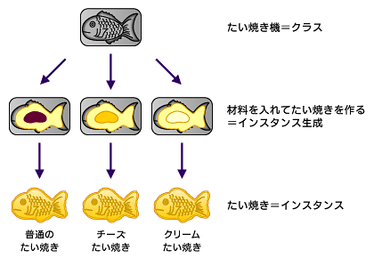

<div class="title">DA研 プログラミング勉強会</div>

---

<!-- _class:  mokuji invert -->

<div class="split">
<div class="percent_45">

# <span style="float:right">目次

</div>
<div class="percent_50" style="padding: 20px 0 0 30px">

###### <span style="font-size:18px">クリックすることでそのページに飛びます</span>

</div>
</div>

###### <br>

<div class="split">
<div class="percent_45">

1. ## [タプル `tuple`](#3)

2. ## [集合 `set`](#9)

</div>
<div class="percent_10">
</div>
<div class="percent_45">

3. ## [辞書 `dict`](#18)

4. ## [クラス](#28)

</div>
</div>

---

<!-- _class:  mokuji invert -->

# <br>

<div class="split">
<div class="percent_45">

1. # タプル `tuple`

2. ## [集合 `set`](#9)

</div>
<div class="percent_10">
</div>
<div class="percent_45">

3. ## [辞書 `dict`](#18)

4. ## [クラス](#28)

</div>
</div>

---

## タプルについて

##### 複数のデータの組み合わせから構成されているデータを表現する場合，タプルを使用すると便利です．タプルのことを単に「組」とも言います．

<br>

例えば...

- 地図 `(地名, 緯度, 経度)`

- レシート `(商品, 値段)`

- 名簿 `(名字, 名前)`

- RGB `(赤の明度, 緑の明度, 青の明度)`

異なる型のデータでも組み合わせることができる！

---

## タプルの作成

##### `a = tuple()`とすると，何も入っていない空のタプルを作成することができます．

<div class="split">
<div class="percent_60">

##### <br>

```python
a = tuple()
print(a)
```

</div>
<div class="percent_35">

##### 実行結果

```

()
```

</div>
</div>

##### `a = ("りんご", 190)`のように括弧で囲うと，"りんご"と190を要素に持つタプルが作成されます．

<div class="split">
<div class="percent_60">

##### <br>

```python
a = ("りんご", 190)
print(a)
```

</div>
<div class="percent_35">

##### 実行結果

```

("りんご", 190)
```

</div>
</div>

---

## 要素へのアクセス

##### タプルも配列と同様に，1番目の要素を`a[0]`，2番目の要素を`a[1]`，3番目の要素を`a[2]`などと表します．

<div class="split">
<div class="percent_60">

##### <br>

```python
a = ("Paris", 48.72, 2.38)
print(a[0])
print(a[1])
print(a[2])
```

</div>
<div class="percent_35">

##### 実行結果

```

"Paris"
48.72
2.38
```

</div>
</div>

###### 0-indexedに注意！

---

## ミュータブルとイミュータブル

##### Pythonのデータ型には，ミュータブル(mutable)とイミュータブル(immutable)があります．

##### ミュータブルなデータは値を変更することができます．<br>イミュータブルなデータは値を変更することができません．

##### Pythonの配列`list`はミュータブルなので値を変更できますが，タプル`tuple`はイミュータブルなので変更することができません．

<div class="split">
<div class="percent_60">

##### <br>

```python
a = (1, 2, 3)
a[1] = 6
print(a)
```

</div>
<div class="percent_35">

##### 実行結果

<pre style="font-size: 30px; color: #ff6666">

TypeError

</pre>

</div>
</div>

---

## タプルの要素の追加

##### タプルはイミュータブルであるため，要素の変更や削除，任意の位置への要素の追加はできませんが，`+`演算子を使って先頭や末尾へ要素を追加することはできます．

<div class="split">
<div class="percent_60">

##### <br>

```python
a = (1, 2)
print(a)
a = (0,) + a  # タプルの先頭に追加
print(a)
a = a + (3,)  # タプルの末尾に追加
print(a)
```

</div>
<div class="percent_35">

##### 実行結果

```

(1, 2)

(0, 1, 2)

(0, 1, 2, 3)
```

</div>
</div>

###### ※要素数1のタプルには，末尾のカンマが必要です！

---

<!-- _class:  mokuji invert -->

# <br>

<div class="split">
<div class="percent_45">

1. ## [タプル `tuple`](#3)

2. # 集合 `set`

</div>
<div class="percent_10">
</div>
<div class="percent_45">

3. ## [辞書 `dict`](#18)

4. ## [クラス](#28)

</div>
</div>

---

## 集合について

##### **重複のない**要素の集まりを効率的に管理したいとき，集合を使うと便利です．

<br>

例えば...

- メールアドレス `{"example@gmail.com", "example@yahoo.co.jp", ...}`

- SNSのユーザー名とパスワードの組み合わせ<span style="float: right; margin-right: 160px; margin-bottom: 20px">`{(user1, pass1), (user2, pass2), ...}`</span>

どちらもそれぞれ世界に1つしかない要素の集合になっている．

###### ユーザー名には被りがあるかもしれませんが，パスワードと組み合わせることによって一意性を得ることができています．

---

## 集合の作成

##### `a = set()`とすると，何も入っていない空の集合を作成できます．

<div class="split">
<div class="percent_60">

##### <br>

```python
a = set()
print(a)
```

</div>
<div class="percent_35">

##### 実行結果

```

{}
```

</div>
</div>

##### `a = {1, 2}`のように波括弧で要素を囲うと，1, 2を要素に持つ集合が生成されます．

<div class="split" style="padding-top: 20px">
<div class="percent_60">

```python
a = {1, 2}
print(a)
```

</div>
<div class="percent_35">

```

{1, 2}
```

</div>
</div>

---

## 要素の追加

##### 集合に要素を追加するには，`add()`を使用します．

<div class="split">
<div class="percent_60">

##### <br>

```python
a = {1, 2, 3}
a.add(4)
print(a)
```

</div>
<div class="percent_35">

##### 実行結果

```


{1, 2, 3, 4}
```

</div>
</div>

集合は重複を許さないので，既に含まれている要素を追加しても変わりません．

<div class="split" style="margin-top: 20px">
<div class="percent_60">

```python
a.add(2)
print(a)
```

</div>
<div class="percent_35">

```

{1, 2, 3, 4}
```

</div>
</div>

---

<h2 style="margin: 0">要素の削除</h2>

<h5 style="margin: 0">集合から要素を削除したいときには，`remove()`を使う方法と`discard()`を使う方法， `pop()`を使う方法の3通りあります．</h5>

<br>

1. 要素の値を指定して削除する`remove()`

<p style="margin: 0"><code>a.remove(x)</code>で集合`a`の要素xを削除します．</code>

<div class="split" style="margin: 0; padding: 0">
<div class="percent_60">

##### <br>

```python
a = {1, 2, 3}
a.remove(1)
print(a)
```

</div>
<div class="percent_35">

##### 実行結果

```


{2, 3}
```

</div>
</div>

存在しない要素を削除しようとした場合，`KeyError`が出ます．

<div class="split" style="margin-top: 10px">
<div class="percent_60">

```python
a.remove(4)
```

</div>
<div class="percent_35">

<pre style="font-size: 30px; color: #ff6666">
KeyError: 4
</pre>

</div>
</div>

---

2. 要素の値を指定して削除する`discard()`

`a.discard(x)`で集合`a`の要素xを削除します．

<div class="split">
<div class="percent_60">

##### <br>

```python
a = {1, 2, 3}
a.discard(1)
print(a)
```

</div>
<div class="percent_35">

##### 実行結果

```


{2, 3}
```

</div>
</div>

存在しない要素を削除しようとした場合，何もしません．

<div class="split" style="margin-top: 10px">
<div class="percent_60">

```python
a.discard(4)
print(a)
```

</div>
<div class="percent_35">

```

{1, 2, 3}
```

</div>
</div>

---

3. 集合の中の要素を1つ削除する`pop()`

`a.pop()`で集合`a`の中の要素を1つ削除し，その値を返します．

<div class="split">
<div class="percent_60">

##### <br>

```python
a = {1, 2, 3}
b = a.pop()
print(a)
print(b)
```

</div>
<div class="percent_35">

##### 実行結果

```


{2, 3}
1
```

</div>
</div>

空の集合から要素を削除しようとした場合，`TypeError`が出ます．

<div class="split" style="margin-top: 10px">
<div class="percent_60">

```python
a = set()
a.pop()
print(a)
```

</div>
<div class="percent_35">

<pre style="font-size: 30px; color: #ff6666">

TypeError

</pre>

</div>
</div>

---

## 要素の存在確認

##### 集合に特定の要素が含まれているかを確認するには，`in`キーワードを使用します．

<div class="split">
<div class="percent_60">

##### <br>

```python
a = {1, 2, 3}
print(1 in a)
print(5 in a)
```

</div>
<div class="percent_35">

##### 実行結果

<pre style="font-size: 30px">

<code class="true">True</code>
<code class="false">False</code>
</pre>

</div>
</div>

配列でも同様に`in`キーワードで要素の存在確認をすることができますが，**計算量**が異なります．

###### 計算量の話はまたいつか...

---

## リストから重複を取り除く

##### 集合は重複を許さないので，リスト→集合→リストと変換することで，リストの重複を消すことができます．

<div class="split" style="margin-bottom:15px">
<div class="percent_60">

##### <br>

```python
a = [1, 1, 2, 2, 2, 3, 4, 5, 5]
a_set = set(a)
a_unique = list(a_set)
print(a_unique)
```

</div>
<div class="percent_35">

##### 実行結果

```


[1, 2, 3, 4, 5]
```

</div>
</div>

`a_unique = list(set(a))`と一行で書くこともできる！

---

<!-- _class:  mokuji invert -->

# <br>

<div class="split">
<div class="percent_45">

1. ## [タプル `tuple`](#3)

2. ## [集合 `set`](#9)

</div>
<div class="percent_10">
</div>
<div class="percent_45">

3. # 辞書 `dict`

4. ## [クラス](#28)

</div>
</div>

---

## 辞書について

##### 「**K**の値を指定すれば**V**の値が定まる」という関係にあるデータを効率的に管理したいとき，辞書(`dict`)を使うと便利です．

この**K**と**V**にあたる値をそれぞれ**キー**と**バリュー**と呼びます．

<p style="margin-top:20px">例えば...</p>

- TODOリスト `{"task1": "deadline1", "task2": "deadline2", ...}`

- 電話帳 `{"Taro": "012-3456-7890", "Hanako": 098-7654-3210, ...}`

※キーは一意である必要がありますが，バリューはそうでなくてもかまいません．

###### TODOリストでは，同じタスクがあってはいけませんが，同じ期限のタスクがあってもいいですよね？

---

## 辞書の作成

##### `a = dict()`とすると，何も入っていない空の辞書を作成できます．

<div class="split">
<div class="percent_55">

##### <br>

```python
a = dict()
print(a)
```

</div>
<div class="percent_40">

##### 実行結果

```

{}
```

</div>
</div>

`a = {"k1": "v1", "k2": "v2"}`のように，キーとバリューをコロンで区切って波括弧で囲うと，"k1": "v1"と"k2": "v2"をキーとバリューのペアとして持つ辞書が生成されます．

<div class="split" style="padding-top: 20px">
<div class="percent_55">

```python
a = {"k1": "v1", "k2": "v2"}
print(a)
```

</div>
<div class="percent_40">

```

{"k1": "v1", "k2": "v2"}
```

</div>
</div>

---

## 要素へのアクセス

##### 辞書の要素にアクセスするには，キーを使用します．

例えば，先ほど作成した`a = {"k1": "v1", "k2": "v2"}`という辞書においては，バリュー`"v1"`はキー`"k1"`を用いて`a["k1"]`で表します．

<div class="split">
<div class="percent_60">

##### <br>

```python
a = {"k1": "v1", "k2": "v2"}
print(a["k1"])
```

</div>
<div class="percent_35">

##### 実行結果

```

v1
```

</div>
</div>

存在しないキーを指定した場合，KeyErrorが出ます．

<div class="split" style="padding-top: 20px">
<div class="percent_60">

```python
print(a["k3"])
```

</div>
<div class="percent_35">

<pre style="font-size: 30px; color: #ff6666">
KeyError: "k3"
</pre>

</div>
</div>

---

## 要素の追加

##### 辞書に要素を追加するには，新しいキーとバリューのペアを指定して代入します．

`a[key] = value`で辞書`a`にキー`key`とバリュー`value`を追加します．

<div class="split">
<div class="percent_60">

##### <br>

```python
a = dict()
a["one"] = 1
print(a)
a["two"] = 2
print(a)
```

</div>
<div class="percent_35">

##### 実行結果

```


{"one": 1}

{"one": 1, "two": 2}
```

</div>
</div>

---

## 要素の変更

##### 辞書のバリューを変更したいときは，既存のキーを指定して新しい値を代入します．

`a[key] = new_value`で辞書`a`のキー`key`に対応するバリューを`new_value`に変更します．

<div class="split">
<div class="percent_60">

##### <br>

```python
a = {"k1": "v1"}
print(a)
a["k1"] = "new_v1"
print(a)
```

</div>
<div class="percent_35">

##### 実行結果

```

{"k1": "v1"}

{"k1": "new_v1"}
```

</div>
</div>

---

## 要素の削除

##### 辞書`a`から要素を削除したいときには，`pop()`を使用します．

`a.pop(k)`で辞書`a`からキーがkであるような要素を削除し，そのバリューを返します．

<div class="split">
<div class="percent_55">

##### <br>

```python
a = {"k1": "v1", "k2": "v2"}
print(a)
b = a.pop("k1")
print(a)
print(b)
```

</div>
<div class="percent_40">

##### 実行結果

```

{"k1": "v1", "k2": "v2"}

{"k2": "v2"}
v1
```

</div>
</div>

---

<h2 style="margin: 0">キーリストの取得</h2>

##### 辞書のキーリストを取得したいときは，`keys()`を使用します．

<p style="margin-bottom: 0"><code>a.keys()</code>で辞書<code>a</code>のキーリストを取得できます．</p>

<div class="split">
<div class="percent_55" style="margin-bottom: 20px">

##### <br>

```python
a = {"k1": "v1", "k2": "v2"}
print(a)
b = a.keys()
print(b)
```

</div>
<div class="percent_40">

##### 実行結果

```

{"k1": "v1", "k2": "v2"}

dict_keys(["k1", "k2"])
```

</div>
</div>

<p style="margin-bottom: 0"><code>dict_keys</code>のままでは使いにくいので，<code>list()</code>で配列に変換することが多いです．</p>

<div class="split" style="margin-top: 20px">
<div class="percent_55">

```python
b_list = list(b)
print(b_list)
```

</div>
<div class="percent_40">

```

["k1", "k2"]
```

</div>
</div>

---

<h2 style="margin: 0">バリューリストの取得</h2>

##### 辞書のバリューリストを取得したいときは，`values()`を使用します．

<p style="margin-bottom: 0"><code>a.values()</code>で辞書<code>a</code>のバリューリストを取得できます．</p>

<div class="split" style="margin-bottom: 20px">
<div class="percent_55">

##### <br>

```python
a = {"k1": "v1", "k2": "v2"}
print(a)
b = a.values()
print(b)
```

</div>
<div class="percent_40">

##### 実行結果

```

{"k1": "v1", "k2": "v2"}

dict_values(["v1", "v2"])
```

</div>
</div>

<p style="margin-bottom: 0"><code>dict_values</code>のままでは使いにくいので，<code>list()</code>で配列に変換することが多いです．</p>

<div class="split">
<div class="percent_55">

```python
b_list = list(b)
print(b_list)
```

</div>
<div class="percent_40">

```

["v1", "v2"]
```

</div>
</div>

---

<h2 style="margin: 0">キーとバリューのペアリストの取得</h2>

<h5 style="margin-top: 10px">キーとバリューのペアリストを取得したいときは，`items()`を使用します．</h5>

<p><code>a.items()</code>で辞書<code>a</code>のキーとバリューのペアリストを取得できます．</p>

```python
a = {"k1": "v1", "k2": "v2"}
print(a)
b = items(a)
print(b)
```

<h5 style="margin: 10px">実行結果</h5>

```

{"k1": "v1", "k2": "v2"}

dict_items([("k1": "v1"), ("k2": v2)])
```

<p style="margin: 0">dict_itemsのままでは使いにくいので...(以下略)</p>

---

<!-- _class:  mokuji invert -->

# <br>

<div class="split">
<div class="percent_45">

1. ## [タプル `tuple`](#3)

2. ## [集合 `set`](#9)

</div>
<div class="percent_10">
</div>
<div class="percent_45">

3. ## [辞書 `dict`](#18)

4. # クラス

</div>
</div>

---

## クラスについて

##### データとそれに関連する操作をまとめて扱いたいときは，クラスを使うと便利です．

<br>

##### クラスを利用することのメリット

- コードを再利用することができる

- データ(**属性**)と操作(**メソッド**)をまとめて整理できる

- オブジェクトの状態を簡単に管理できる

###### オブジェクト指向，継承，カプセル化，ポリモーフィズム...&nbsp;&nbsp;&nbsp;詳しくはいつか勉強しましょう

---

## クラスのインスタンス

<div class="split" style="margin-bottom:15px">
<div class="percent_55">

##### クラスという設計図をもとに生成された具体的なオブジェクトのことを**インスタンス**と言います．

##### クラスはオブジェクトの構造(属性やメソッド)を定義し，インスタンスはその構造に従って実際に作られた個々のオブジェクトです．

##### クラスのインスタンスは，右の図のようによくたい焼き機に例えられます．

</div>
<div class="percent_45">



</div>
<div class="percent_40">

</div>
</div>

<h6 style="margin:0; text-align:right">“たい焼き”であま～く理解するJava文法と言語仕様</h6>

<a href="https://atmarkit.itmedia.co.jp/ait/articles/0803/12/news148.html" style="font-size:26px; float:right">https://atmarkit.itmedia.co.jp/ait/articles/0803/12/news148.html</a>

---

## クラスの作成

<h5 style="margin:0"><code>class</code>キーワード`とコンストラクタ(<code>__init__</code>メソッド)を使って，以下のようにクラスを作成することができます．</h5>

<div class="split" style="margin-bottom:15px">
<div class="percent_55">

##### <br>

```python
class MyClass:
  def __init__(self):
    pass

print(MyClass)
```

</div>
<div class="percent_45">

##### 実行結果

```


<class '__main__.MyClass'>
```

</div>
</div>

`self`はクラス内でインスタンス変数やインスタンスメソッドにアクセスするために使用される特別な変数です．<br>文字通りそのインスタンス自身を表す変数です．

---

## 属性の定義

##### クラスの属性には**クラス属性**と**インスタンス属性**があります．

- <h5 style="margin-top:40px; line-height:40px"><strong>クラス属性</strong>はクラス自体に属する属性です．すべてのインスタンスで共有され，<u>クラス名を使ってアクセスします</u>．クラスの定義内で直接定義されます．</h5>

- <h5 style="margin-top:40px; line-height:40px"><strong>インスタンス属性</strong>はクラスの各インスタンスに固有の変数です．インスタンスごとに異なる値を持つことができ，<u>インスタンス名を使ってアクセスします</u>．<br>通常，コンストラクタ(<code>__init__</code>メソッド)の中で<code>self</code>キーワードを使って定義されます．</h5>

---

<div class="split">
<div class="percent_60">

```python
class MyClass:
  x = 10

  def __init__(self, a, b):
    self.n = a
    self.s = b
```

</div>
<div class="percent_35" style="padding-top:25px">

##### ←これがクラス属性

##### <br>

##### ←これがインスタンス属性

</div>
</div>

<div class="split">
<div class="percent_60">

<h5 style="margin:0"><br></h5>

```python
print(MyClass.x) # クラス名でアクセス

c1 = MyClass(3, "python")
print(c1.n) # インスタンス名でアクセス
print(c1.s)

c2 = MyClass(5, "class")
print(c2.n + MyClass.x)
print(c2.s)
```

</div>
<div class="percent_35">

<h5 style="margin:0">実行結果</h5>

```
10


3
python


15
class
```

</div>
</div>

---

<h2 style="margin:0; padding:0">メソッドの定義</h2>

##### クラスのメソッドには**インスタンスメソッド**，**クラスメソッド**，**静的メソッド**と**特殊メソッド**があります．今回はそのうち，インスタンスメソッドと特殊メソッドについて取り上げます．

- **インスタンスメソッド**はクラスのインスタンスに関連付けられており，インスタンスの属性にアクセスしたり操作したりするために使います．

- **特殊メソッド**は特定の状況で自動的に呼び出されるメソッドです．これらのメソッドは通常，二重のアンダースコア(`__`)で囲まれた名前を持ちます．

---

<h2 style="margin:0; padding:0">インスタンスメソッド</h2>

##### インスタンスメソッドはクラス内で`def`キーワードを使って定義されます．最初の引数として`self`をとります．その他に関してはほとんど関数の定義と同様です．

<div class="split" style="margin-top:25px">
<div class="percent_60">

```python
class MyInt:
  def __init__(self, n):
    self.n = n

  def add(self, m):
    self.n += m
```

</div>
<div class="percent_35">

<br><br><br><br>

##### 実行結果

</div>
</div>

<div class="split">
<div class="percent_60">

```python
a = MyInt(10)
a.add(4)
print(a.n)
a.add(-9)
print(a.n)
```

</div>
<div class="percent_35">

```


14

5
```

</div>
</div>

---

## 特殊メソッド

##### クラスにはいくつかの特殊なメソッドが存在します．`__init__`メソッドもクラスを作成するための特殊メソッドです．

##### 特によく使う以下の2つの特殊メソッドを紹介します．

1. ##### `__str__`メソッド

<ul>`str`関数や`print`関数で表示されるインスタンスの文字列表現を定義することができます．</ul>

2. ##### `__getitem__`メソッド

<ul>インスタンスがリストや辞書のようにインデックスやキーでアクセスされるときに呼び出されます．</ul>

---

<style scoped>
  pre code {
    font-size: 28px
  }
</style>

<h5 style="margin-bottom:15px">&nbsp;&nbsp;&nbsp;&nbsp;1. <code>__str__</code>メソッド</h5>

```python
class Human:
  def __init__(self, name, age):
    self.name = name
    self.age = age

  def __str__(self):
    return f"My name is {self.name}. I'm {self.age} years old."

Taro = Human("Taro", 20)
print(Taro)

Hanako = Human("Hanako", 19)
print(Hanako)
```

</div>

##### 実行結果

```
My name is Taro. I'm 20 years old.
My Name is Hanako. I'm 19 years old.
```

---

<style scoped>
  pre code {
    font-size: 28px
  }
</style>

<h5 style="margin:20px">&nbsp;&nbsp;&nbsp;&nbsp;2. <code>__getitem__</code>メソッド</h5>

```python
class EmptyClass:
  def __getitem__(self, key):
    return key

ec = EmptyClass()
print(ec[0])
print(ec["ok!"])
print(ec[Taro])
```

##### 実行結果

```
0
ok!
My name is Taro. I'm 20 years old.
```

---

## クラスを実装する

##### 以下の要件を満たすクラスを実装してください．

<br>

&nbsp;&nbsp;&nbsp;&nbsp;**テーマ「銀行口座管理システム」**

- クラス名は`BankAccount`とする

- 口座所有者の名前(`owner_name`)，口座番号(`account_number`)，残高(`balance`)を属性として持つ

- インスタンスを`print()`したとき，`これは〇〇の口座です`と表示する

- 残高を表示するメソッド`display_balance`を持つ

- 入金するメソッド`deposit`と出金するメソッド`withdraw`を持つ

- 出金時に残高が不足している場合は警告メッセージを表示する

---

<h2 style="margin:8px; padding:0">正解例コード</h2>

```python
class BankAccount:
  def __init__(self, owner_name, account_number, balance=0):
    self.owner_name = owner_name
    self.account_number = account_number
    self.balance = balance

  def __str__(self):
    return f"これは{self.owner_name}の口座です"

  def display_balance(self):
    print(f"残高: {self.balance}円")
```

関数の引数に`balance=0`とするとデフォルト引数が設定され，呼び出す際に`balance`に引数を与えなかったら勝手に`balance`は0になります．

<h6 style="margin:0">続きは次ページ</h6>

---

## 正解例コード

```python
  def deposit(self, amount):
    if amount > 0:
      self.balance += amount
      print(f"{amount}円を入金しました")
    else:
      print("有効な金額を入力してください")

  def withdraw(self, amount):
    if amount > self.balance:
      print("残高不足です")
    elif amount > 0:
      self.balance -= amount
      print(f"{amount}円を出金しました")
    else:
      print("有効な金額を入力してください")
```

---

<h2 style="margin:0; padding:0">確認してみる</h2>

##### 確認コード

```python
account1 = BankAccount("山田太郎", "123456789")
print(account1)
account1.display_balance()
account1.deposit(5000)
account1.display_balance()
account1.withdraw(2000)
account1.display_balance()
account1.withdraw(5000)
```

##### 実行結果

```
これは山田太郎の口座です
5000円を入金しました
2000円を出金しました
残高不足です
```
